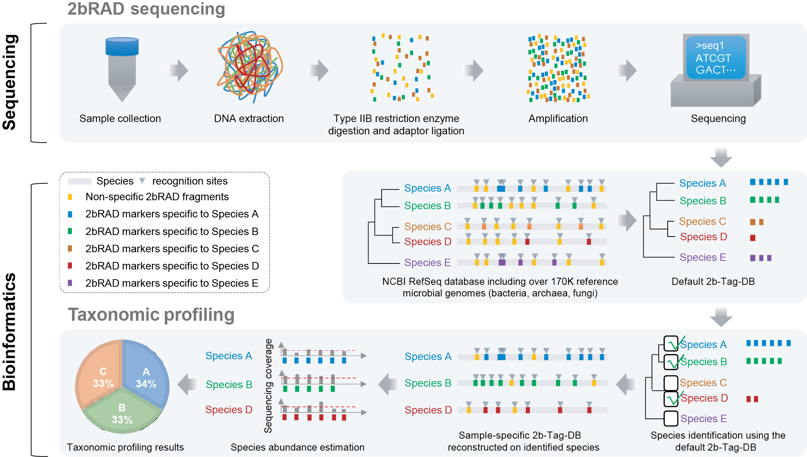

# 2bRAD-M
----------------------------
This repository provides the computational pipeline for microbiome analysis on 2b-RAD data presented in the paper below:

[Species-resolved sequencing of low-biomass microbiomes by 2bRAD-M](https://www.biorxiv.org/content/10.1101/2020.12.01.405647v1) by Zheng Sun, Shi Huang, Pengfei Zhu, Lam Tzehau, Helen Zhao, Jia Lv, Rongchao Zhang, Lisha Zhou, Qianya Niu, Xiuping Wang, Meng Zhang, Gongchao Jing, Zhenmin Bao, Jiquan Liu, Shi Wang, Jian Xu. BioRxiv, doi: https://doi.org/10.1101/2020.12.01.405647

## How it works
 The principle of 2bRAD-M on microbiome analyses on low-biomass samples: 
 
 (1) reliable enzyme-digested sequence tags can be derived that are specific to high-resolution taxa (e.g., species or strain) yet universally applicable for a broad range or all of bacterial, archaeal and fungal genomes; 
 
 (2) these taxa-specific, iso-length sequence tags can be evenly amplified and sequenced;
 
 (3) the tag sequences can be mapped to reference genomes to reconstruct faithfully the taxonomic composition.
 
 You can also find more details for the 2bRAD-M workflow below. 
 
 
 
 * The experimental workflow has two steps: 
 
   (1) BcgI (a commercially available Type IIB restriction enzymes) is used, as an example, to digest total genomic DNA extracted from microbiome samples. BcgI recognizes the sequence of CGA-N6-TGC in the genomic DNA and cleaves on both upstream (12-10 bp) and downstream (10-12 bp) of this signature, producing short and iso-length DNA (32bp without sticky ends) across all loci. 
   
   (2) These so-called “2bRAD fragments” are ligated to adaptors, amplified and then sequenced. 
   
 * The computational workflow. The foundation here is a unique 2bRAD tag database (“2b-Tag-DB”), which contains taxa-specific 2bRAD tags identified from all the sequenced bacteria, fungi and archaea genomes. Mapping the 2bRAD reads against 2b-Tag-DB thus identifies the presence of species in a sample. Subsequently, to estimate relative abundance of the identified taxa, the mean read coverage of all 2bRAD tags specific to each taxon is derived. To improve utilization rate of reads and classification accuracy, a secondary, sample-specific 2b-Tag-DB was dynamically derived from only those candidate taxa identified in a particular sample, which produces more species-specific 2bRAD tags than the original 2b-Tag-DB and results in more accurate modeling of relative abundance of taxa.

## Installation
 ### System requirements
 #### Dependencies
 All scripts in 2bRAD-M are written using Perl and recommended to run in a conda environment. In the Unix systems, or Mac OSX, the program should work properly as all required packages can be appropreiately download and installed in the conda environment. 
 #### Disk space
 Construction of a 2bRAD-M standard database (i.e., 2b-Tag-DB) requires approximately 10 GB of disk space. 
 #### Memory usage
 Running the standard pipeline requires < 30Gb of RAM, which is also compatible with multithreading. For example, the BcgI-derived (default) database size is 9.32 GB, and you will need more than that in RAM if you want to build the default database. In a test early on, the peak memory can reach up to 29GB.
 #### Speed 
About 20 minutes are required for loading the 2b-Tag-DB. For a typical gut metagenome, ~40 minutes are required for species profiling.
 
 ### Download the pipeline
 * Clone the latest version from GitHub (recommended):  
 
   `git clone https://github.com/shihuang047/2bRAD-M/`
   
   `cd 2bRAD-M`
   
    This makes it easy to update the software in the future using `git pull` as bugs are fixed and features are added.
 * Directly download without installing GitHub:
 
   `wget https://github.com/shihuang047/2bRAD-M/archive/master.zip`
   
   `unzip master.zip`
   
   `cd 2bRAD-M-master`
   
 ### Install 2bRAD-M pipeline in a conda environment 
 * Conda installation
   [Miniconda](https://docs.conda.io/en/latest/miniconda.html) provides the conda environment and package manager, and is the recommended way to install 2bRAD-M. 
 * Create a conda environment for 2bRAD-M pipeline:
   After installing Miniconda and opening a new terminal, make sure you’re running the latest version of conda:
   
   `conda update conda`
   
   Once you have Miniconda installed, create a conda environment with the yml file `tools/2bRAD-M-20201225-conda.yml`.
   
   `conda env create -n 2bRAD-M-20201225 --file tools/2bRAD-M-20201225-conda.yml`
   
 * Activate the 2bRAD-M conda environment by running the following command:
 
   `source activate 2bRAD-M-20201225`

 ### Construct the reference 2B-Tag database (required)
 * Construct the 2bRAD-M species unique marker database (2B-Tag-DB)
   
   (1) Download the prebuilt 2b-Tag-DB from Figshare based on the NCBI Refseq (Oct., 2019).
   
   (2) Download the full genomes from NCBI Refseq for secondary 2b-Tag-DB construction for each sample.
   
   (3) Download the example datasets for pipeline tutorial
    
    `perl tools/Download_2bRADTagDB.pl $your_database_path`
    
    By default, `$your_database_path=./2B-RAD-M-ref_db/`
    
    It usually can take around 30 mins to save all files in the `$your_database_path`, but it still depends on your internet connenction speed and stability.
 
## 2bRAD-M pipeline tutorial

* **Overview of the 2bRAD-M pipeline**

    The 2bRAD-M analysis pipeline comprises a combination of 2bRAD-M scripts and optimized parameters for analyzing the 2bRAD or shotgun metagenomics sequencing data, which can output the most comprehensive output on each sample. The pipeline includes:

    (1) **The digital restriction digestion** It is required when input DNA sequences are longer than 31bp or 33bp (e.g., 150bp) or derived from the common shotgun sequencing protocols. If input DNA sequences were produced by the 2bRAD sequencing protocol this step will be skipped. 
       
    (2) **Qualitative analysis** Identify the microbes and estimate their abundances based on the 2bRAD (such as. BcgI derived) species-specific markers of a prebuilt and comprehensive 2b-Tag-DB based on the NCBI Refseq (Oct., 2019).
       
    (3) **Quantitative analysis** Estimate the microbial abundances more precisely based on the 2bRAD species-specific markers in a sample-specific 2b-Tag-DB that contains only condidate genomes that identified in the given biolgical sample. Given the sample-specific 2b-Tag-DB is more compact, it produces more species-specific 2bRAD markers than the original 2b-Tag-DB and results in more accurate modeling of relative abundance of taxa.
    	

* **Usage**
    
    The main script for implementing those analysis steps is located at `bin/2bRADM_Pipline.pl`. You can check out the usage by printing the help information via `perl bin/2bRADM_Pipline.pl -h`.
    
```
DESCRIPTION
	We here provided a streamlined 2bRAD pipeline for analyzing microbial compositions from the 2bRAD/shotgun metagenomics data based on the species-specific 2bRAD markers.
USAGE
	perl bin/2bRADM_Pipline.pl
PARAMETERS
         -t   <int>    The acceptable types of an input sequencing data file. The file path should be also listed in the sample list file (para -l).
                       [1] generic genome data in a fasta format
                       [2] shotgun metagenomic data in a fastq format(either SE or PE platform is accepted)
                       [3] 2bRAD data from a SE sequencing platform in a fastq format
                       [4] 2bRAD data from a PE sequencing platform in a fastq format
         -l   <file>   The filepath of the sample list. Each line includes an input sample ID and the file path of corresponding DNA sequence data where each field should be separated by <tab>. A line in this file that begins with # will be ignored. Only four formats of a sample list file are accepted and should match with parameter -t: 
                       [1] sample<tab>sample.fa(.gz)
                       [2] sample<tab>shotgun.1.fq(.gz)(<tab>shotgun.2.fq.gz)
                       [3] sample<tab>2bsingle.fq(.gz or 2bsingle.1.fq.gz)
                       [4] sample1<tab>sample2<tab>sample3<tab>sample4<tab>sample5<tab>R1.fq(.gz)<tab>R2.fq(.gz)
         -d   <dir>    The working path of 2B-Tag-DB.
         -o   <dir>    The output directory (if it doesn't exist, will be created automatically as 'outdir').
       OPTIONS of Qualitative Analysis
         -p   <str>   If qualitative analysis applies or not [default: yes] (yes or no)
         -s1  <str>   The enzyme site(s) for the qualitative analysis. One or more sites can be specified(comma separated) [default: 5]
                      It represents which enzyme(s) will be used for digital restriction digestion, the contruction of 2b-Tag-DB for the following qualitative analysis and quantitative analysis).
                      [1]CspCI  [5]BcgI  [9]BplI     [13]CjePI  [17]AllEnzyme
                      [2]AloI   [6]CjeI  [10]FalI    [14]Hin4I
                      [3]BsaXI  [7]PpiI  [11]Bsp24I  [15]AlfI
                      [4]BaeI   [8]PsrI  [12]HaeIV   [16]BslFI
         -t1  <str>   The taxonomic level for 2bRAD markers in the qualitative database, which should be one of the following: kingdom,phylum,class,order,family,genus,species,strain. [default: species]
       OPTIONS of Quantitative Analysis
         -q   <str>   If the quantitative analysis applies or not [default: yes] (yes or no)
         -gsc <int>   G score threshold for identifying the condidate microbes present in a sample in qualitative analysis, which also determines the membership of sample-specific 2B-Tag-DB in the quantitative analysis step. [default: 5, it means >5]
         -gcf <int>   The threshold of the 2bRAD tag number for the presence of a microbial genome (i.e., GCF) in the qualitative analysis, which also determines the membership of sample-specific 2B-Tag-DB in the quantitative analysis step. [default: 1, it means >1]
         -s2  <str>   The enzyme site for the quantitative analysis. (refer to -s1) [default: 5, must be included in para -s1]
         -t2  <str>   The taxonomic level for 2bRAD markers in the quantitative analysis, which should be one of the following: kingdom,phylum,class,order,family,genus,species,strain. [default: species]
       OPTIONS of CPU
         -c1  <int>   The number of CPUs used in the digital digestion step for multiple samples. [default: 10]
         -c2  <int>   The number of CPUs used for calculating the abundance for multiple samples and enzymes. [default: 8] (each CPU needs about 15~65G of memory)
       OPTIONS of Quality Control
         -qc  <str>   If quality control apply or not. [default: yes] (yes or no)
         -qcn <float> The maximum ratio of base "N". [default: 0.08]
         -qcq <int>   The minimum quality score to keep. [default: 30]
         -qcp <int>   The minimum percentage of bases that must have [-qcq] quality. [default: 80]
         -qcb <int>   The quality values of base [default: 33]
       OPTIONS of Merging profiles
         -ms  <str>   The mock-community sample name(s) (separated by commas). The specified samples will be removed from the merged output table.
         -ncs <str>   The sample name(s) (separated by commas) of negative control that can be used for filtering potential contaminations.
         -h|help   Print this help information.

```
 
* **Example data**

   * [Analyze in silico mock community (synthetic 2bRAD sequencing data: `simulate_50.BcgI.fq.gz`)](docs/analyze_simulate_50.md) To test the generalizability of our 2bRAD markers for microbial profiling, we designed a mock microbiome structure containing 50 microbial species from a wide range of habitats such as oral, gut and soil environments. Given a specified abundance profile, we simulated the sequencing data based on all related genomes using [wigsim](https://github.com/lh3/wgsim). The sequencing data file `simulate_50.BcgI.fq.gz` and its corresponding list file `list_simulation` will be automatically downloaded to `$your_database_path` via `tools/Download_2bRADTagDB.pl` as described above. Once all these downloaded, you can try to run the following command that will output the estimated microbial profile.   
 
  `perl bin/2bRADM_Pipline.pl -t 1 -l $your_database_path/list_simulation -d $your_database_path -o outdir -gsc 60 -qc no`

  * [Analyze the 2bRAD sequencing data of a mock microbial community: MSA1002 (`MSA1002_R1.fq.gz`)](docs/analyze_mock.md)
   [MSA1002](https://www.atcc.org/en/Global/Products/MSA-1002.aspx) comprises the genomic material from 20 microbial strains that are evenly mixed. We sequenced this DNA sample using our 2bRAD protocol for optimizing and testing the bioinformatic pipeline. The sequencing data file `MSA1002_R1.fq.gz` and its corresponding list file `list_mock` will be automatically downloaded to `$your_database_path` via `tools/Download_2bRADTagDB.pl` as described above. Once all these downloaded, you can try to run the following command that will output the estimated microbial profile.
 
  `perl bin/2bRADM_Pipline.pl -t 3 -l $your_database_path/list_mock -d $your_database_path -o outdir`
  
 * **Output formats** 
 
   2bRAD-M offers a standard format of sample-wide results. You can find this standard profiling result of a single sample at `$outdir/quantitative/$sample_id.combine.xls`. Taking the `MSA1002` analysis as example, the output is located at `outdir/quantitative/MSA1002.combine.xls`. 2bRAD-M standard sample report format is tab-delimited with one line per taxon. The fields of the output, from left-to-right, are as follows:

   1 to 7 - The taxonomic ranks for a microbial taxon identified: 1 - "Kingdom"; 2 - "Phylum"; 3 - "Class"; 4 - "Order"; 5 - "Family"; 6 - "Genus"; 7 - "Species"
   
   8 - "Theoretical_Tag_Num": Average number of all 2bRAD marker tags of genomes under this taxon in theory 
   
   9 - "Sequenced_Tag_Num": Number of 2bRAD marker tags detected in the sequencing data under this taxon
   
   10 -  "Percent": The percent of sequenced 2bRAD marker tags under this taxon
   
   11 -  "Sequenced_Reads_Num": Total number of sequenced reads 
   
   12 - "Sequenced_Reads_Num/Theoretical_Tag_Num": The ratio of "Sequenced_Reads_Num" and "Theoretical_Tag_Num"， which further used for calculating "relative abundance" of this taxon within a sample via a normalization by the column-wise sum
   
   13 - "Sequenced_Reads_Num/Sequenced_Tag_Num": The ratio of "Sequenced_Reads_Num" and "Sequenced_Tag_Num"
   
   14 - "Sequenced_Tag_Num(depth>1)": Number of sequenced tags that have >1 sequencing coverage.
   
   15 - "G_Score": the geometric mean of "Sequenced_Reads_Num" and "Sequenced_Tag_Num", which is use for controlling false positive discovery
   
   2bRAD-M also offer a standard format of the study-wise result. This pipeline automatically merged the abundance profiling results from multiple samples, which is located at `$outdir/quantitative/Abundance_Stat.all.xls`. If you setup the negative-control samples for filtering potential contaminations in biological samples, you can find the filtered abundance profiles in the `$outdir/quantitative/Abundance_Stat.filtered.xls`. Otherwise, these two files should be identical. The standard study report format is also tab-delimited with one line per taxon. The fields of the output, from left-to-right, are as follows:
   
   1 to 7 - The taxonomic ranks for a microbial taxon identified: 1 - "Kingdom"; 2 - "Phylum"; 3 - "Class"; 4 - "Order"; 5 - "Family"; 6 - "Genus"; 7 - "Species"
   
   8 to N - The column name indicates a sample ID in this study, where you can find the relative abundances of taxa within this sample. `N = (the number of samples) - 7`
  

## 2bRAD-M scripts for customized analyses 
 * [Extract 2b tags](docs/extract_2b.md)
 * [Build your own customized 2bTag database](docs/build_db.md)
 * [Species profiling for a single sample](doc/profile_single_sample.md)
 * [Merge species profiles for multiple samples](doc/merge_profile_multiple_samples.md)
 
## Acknowledgement

   This work was funded by Grant 31800088 from National Natural Science Foundation and 2019M652501 from China Postdoctoral Science Foundation, and Taishan Scholar Fund of Shandong Province of China. 

